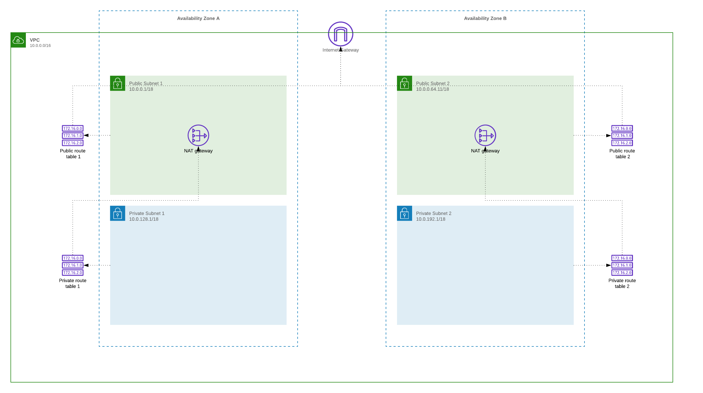

# VIRTUAL PRIVATE CLOUD SETUP

## LAB PURPOSE

Create the VPC with an Internet Gateway and a managed NAT Gateway in each public subnet as well as VPC Route Tables that allow for communication between the public and private subnets



## VPC configuration:
> * VPC CIDR: 10.0.0.0/16
> * PUBLIC SUBNET ONE CIDR: 10.0.0.0/24
> * PUBLIC SUBNET TWO CIDR: 10.0.1.0/24
> * PRIVATE SUBNET ONE CIDR: 10.0.2.0/24
> * PRIVATE SUBNET TWO CIDR: 10.0.3.0/24

## DEFINITIONS
----

### Virtual Private Cloud

VPC is a logically isolated section of the AWS Cloud where you can launch AWS resources in a virtual network that you define.

### Internet Gateway

**Internet Gateway** is a VPC component that allows communication between instances in your VPC and the internet

### Route Table

A **Route table** contains a set of rules, called routes, that are used to determine where network traffic is directed.

### Route

Specifies a route in a **Route table** within a VPC.

### Subnet

A part of VPC with specified IP addresses.

### Public Subnet

A subnet with access to the internet

### Private Subnet

A subnet without access to the internet

### Nat Gateway

Enable instances in a private subnet to connect to the internet or other AWS services, but prevent the internet from initiating a connection with those instances.

### Elastic IP

IP address associated with your AWS account which could be easily assigned to any instance in your account.

## STEPS
---

1. CREATE CLOUDFORMATION TEMPLATE

* Rename boilerplate.yaml to workshop-vpc.yaml, this is the place where you should put all of your resources

2. CREATE VPC RESOURCE

* Go to https://docs.aws.amazon.com/AWSCloudFormation/latest/UserGuide/aws-resource-ec2-vpc.html
* Discover how the VPC cloudformation resource should looks
* Verify which fields are required
* Add the VPC to the Resouces section, and fill all parameters. You can find the configuration in the section **VPC configuration** of this file. As a result, you should have a similar code


```yaml
AWSTemplateFormatVersion: 2010-09-09
Description: >
  This template creates a Virtual Private Cloud, two private subnets and two public subnets,
  an Internet Gateway, pair of NAT Gateways (one in each AZ), and routes
     
Parameters:
  ProjectName:
    Type: String
    Description: Project name, part of the name of all created components
  
  CidrBlock:
    Default: 10.0.0.0/16
    Description: VPC CIDR Block (eg 10.0.0.0/16)
    Type: String

  Environment:
    Type: String
    AllowedValues:
      - dev
      - test
      - prod

Resources:
  VPC:
    Type: AWS::EC2::VPC
    Properties:
      CidrBlock: !Ref CidrBlock
      EnableDnsHostnames: true
      EnableDnsSupport: true
      Tags:
        - Key: Name
          Value: !Sub ${ProjectName}-${Environment}-vpc
        - Key: Environment
          Value: !Ref Environment
```

3. DEPLOY VPC

```bash
aws cloudformation deploy --template-file workshop-vpc.yaml --stack-name workshop-vpc --parameter-overrides ProjectName=workshop Environment=dev CidrBlock=10.0.0.0/16
```

4. VERIFY VPC

*  Go to cloudformation console  https://console.aws.amazon.com/cloudformation, find your stack **workshop-vpc**, and verify what resources have been created, to do that, go to section **Resources**. 

In the console, you can verify also a lot of important things eg. If something went wrong, you could verify the events in section **Events**, or you can check parameters that have been passed to the template in section **Parameters**.

5. CREATE SUBNETS

* Go to https://docs.aws.amazon.com/AWSCloudFormation/latest/UserGuide/aws-resource-ec2-subnet.html
* Discover how the subnet cloudformation resource should looks
* Verify which fields are required
* Create four subnets, two private each in different Availability Zone and two public. Name them: **PrivSubnetOne**, **PrivSubnetTwo**, **PubSubnetOne**, **PubSubnetTwo**. 
To accomplish this task you need to have VPC ID, names of availability zones and CIDR blocks for each subnet.  You can find **VPC ID** by going to AWS console https://console.aws.amazon.com/cloudformation, then to your VPC stack **workshop-vpc**. In section **Resources** , the physical ID of VPC resource will be a sought VPC ID. CIDR block you can find in the section **VPC configuration** of this file. To get the list of all available zones run a **describe-availability-zones** command.  Keep in mind your subnet CIDR blocks need to be smaller than the VPC CIDR block. 

```bash
aws ec2 describe-availability-zones
```
As a result, you should have a similar code:

```yaml
AWSTemplateFormatVersion: 2010-09-09
Description: >
  This template creates a Virtual Private Cloud, two private subnets and two public subnets,
  an Internet Gateway, pair of NAT Gateways (one in each AZ), and routes

Parameters:
  ProjectName:
    Type: String
    Description: Project name, part of the name of all created components
  
  Environment:
    Type: String
    AllowedValues:
      - dev
      - test
      - prod
  
  CidrBlock:
    Default: 10.0.0.0/16
    Description: VPC CIDR Block (eg 10.0.0.0/16)
    Type: String
  
  AvailabilityZoneOne:
    Description: The AvailabilityZoneA to use for the subnet
    Type: AWS::EC2::AvailabilityZone::Name
  
  AvailabilityZoneTwo:
    Description: The AvailabilityZoneB to use for the subnet
    Type: AWS::EC2::AvailabilityZone::Name
  
  PublicSubnetOne:
    Default: 10.0.0.0/24
    Description: VPC CIDR Block for the Public Subnet (eg 10.0.0.0/24)
    Type: String
  
  PublicSubnetTwo:
    Default: 10.0.1.0/24
    Description: VPC CIDR Block for the Public Subnet (eg 10.0.1.0/24)
    Type: String
  
  PrivateSubnetOne:
    Default: 10.0.2.0/24
    Description: VPC CIDR Block for the Private Subnet A (eg 10.0.1.0/24)
    Type: String
  
  PrivateSubnetTwo:
    Default: 10.0.3.0/24
    Description: VPC CIDR Block for the Private Subnet B (eg 10.0.3.0/24)
    Type: String

Resources:
  VPC:
    Type: AWS::EC2::VPC
    Properties:
      CidrBlock: !Ref CidrBlock
      EnableDnsHostnames: true
      EnableDnsSupport: true
      Tags:
        - Key: Name
          Value: !Sub ${ProjectName}-${Environment}-vpc
        - Key: Environment
          Value: !Ref Environment

  ############################## PUBLIC
 
  PubSubnetOne:
    Type: AWS::EC2::Subnet
    Properties:
      AvailabilityZone: !Ref AvailabilityZoneOne
      CidrBlock: !Ref PublicSubnetOne
      MapPublicIpOnLaunch: true
      Tags:
        - Key: Name
          Value: !Sub ${ProjectName}-${Environment}-public-subnet-one
        - Key: Environment
          Value: !Ref Environment
      VpcId: !Ref VPC

  PubSubnetTwo:
    Type: AWS::EC2::Subnet
    Properties:
      AvailabilityZone: !Ref AvailabilityZoneTwo
      CidrBlock: !Ref PublicSubnetTwo
      MapPublicIpOnLaunch: true
      Tags:
        - Key: Name
          Value: !Sub ${ProjectName}-${Environment}-public-subnet-two
        - Key: Environment
          Value: !Ref Environment
      VpcId: !Ref VPC


  ############################## PRIVATE

  PrivSubnetOne:
    Type: AWS::EC2::Subnet
    Properties:
      VpcId: !Ref VPC
      AvailabilityZone: !Ref AvailabilityZoneOne
      CidrBlock: !Ref PrivateSubnetOne
      Tags:
        - Key: Name
          Value: !Sub ${ProjectName}-${Environment}-private-subnet-one
        - Key: Environment
          Value: !Ref Environment

  PrivSubnetTwo:
    Type: AWS::EC2::Subnet
    Properties:
      VpcId: !Ref VPC
      AvailabilityZone: !Ref AvailabilityZoneTwo
      CidrBlock: !Ref PrivateSubnetTwo
      Tags:
        - Key: Name
          Value: !Sub ${ProjectName}-${Environment}-private-subnet-two
        - Key: Environment
          Value: !Ref Environment

Outputs:
  VpcId:
    Description: VPC ID
    Value: !Ref VPC
  VpcCidrBlock:
    Description: Vpc cidr block
    Value: !Ref CidrBlock

  PublicSubnetOneId:
    Description: Public Subnet 1 ID
    Value: !Ref PubSubnetOne
  PublicSubnetTwoId:
    Description: Public Subnet 2 ID
    Value: !Ref PubSubnetTwo

  PrivateSubnetOneId:
    Description: Private Subnet 1 ID
    Value: !Ref PrivSubnetOne
  PrivateSubnetTwoId:
    Description: Private Subnet 2 ID
    Value: !Ref PrivSubnetTwo

```

6. DEPLOY TEMPLATE WITH VPC & SUBNETS

```bash
aws cloudformation deploy --template-file workshop-vpc.yaml --stack-name workshop-vpc --parameter-overrides ProjectName=workshop Environment=dev CidrBlock=10.0.0.0/16 AvailabilityZoneOne=eu-west-1a AvailabilityZoneTwo=eu-west-1b PublicSubnetOne=10.0.0.0/24 PublicSubnetTwo=10.0.1.0/24 PrivateSubnetOne=10.0.2.0/24 PrivateSubnetTwo=10.0.3.0/24
```

7. VERIFY THE STACK

*  Go to the cloudformation console  https://console.aws.amazon.com/cloudformation, find your stack **workshop-vpc**, and verify what resources have been created, to do that, go to section **Resources**. 

8. ENABLE INTERNET ACCESS FOR PUBLIC SUBNETS

* You will need to have **Internet Gateway** to enable internet access for your public subnets
* Go to https://docs.aws.amazon.com/AWSCloudFormation/latest/UserGuide/aws-resource-ec2-internetgateway.html
* Discover how the **Internet Gateway** cloudformation resource should looks
* Create **Internet Gateway** in your code by adding

```yaml
InternetGateway:
  Type: AWS::EC2::InternetGateway
  Properties:
    Tags:
    - Key: Name
      Value: !Sub ${ProjectName}-${Environment}-internet-gateway
    - Key: Environment
      Value: !Ref Environment
```


* Attach an Internet gateway to your VPC. Definition of this resource you can find here https://docs.aws.amazon.com/AWSCloudFormation/latest/UserGuide/aws-resource-ec2-vpc-gateway-attachment.html. You have to specify only **InternetGatewayId** and **VpcId**. Both value you can get from earlier created resources. You should produce

```yaml
 InternetGatewayAttachment:
    Type: AWS::EC2::VPCGatewayAttachment
    Properties:
      InternetGatewayId: !Ref InternetGateway
      VpcId: !Ref VPC
```

* Create a Route table for your public subnets and point them to the internet gateway. To use an internet gateway, your subnet's route table must contain a route that directs internet-bound traffic to the internet gateway. You can scope the route to all destinations not explicitly known to the route table (0.0.0.0/0). To create routes you need to use two cloudformation components: **AWS::EC2::RouteTable** (https://docs.aws.amazon.com/AWSCloudFormation/latest/UserGuide/aws-resource-ec2-route-table.html) and **AWS::EC2::Route** (https://docs.aws.amazon.com/AWSCloudFormation/latest/UserGuide/aws-resource-ec2-route.html)


```yaml
  PublicRouteTable:
    Type: AWS::EC2::RouteTable
    Properties:
      Tags:
        - Key: Name
          Value: !Sub ${ProjectName}-${Environment}-public-route-table
        - Key: Environment
          Value: !Ref Environment
      VpcId: !Ref VPC

  PublicRoute:
    Type: AWS::EC2::Route
    Properties:
      DestinationCidrBlock: 0.0.0.0/0
      GatewayId: !Ref InternetGateway
      RouteTableId: !Ref PublicRouteTable
```

* The last thing to do is to associate the public route table with each of the public subnets. To create association use **AWS::EC2::SubnetRouteTableAssociation** https://docs.aws.amazon.com/AWSCloudFormation/latest/UserGuide/aws-resource-ec2-subnet-route-table-assoc.html . Your code should be similar to the code placed below.

```yaml
PubSubnetOneRouteTableAssociation:
  Type: AWS::EC2::SubnetRouteTableAssociation
  Properties:
    SubnetId: !Ref PubSubnetOne
    RouteTableId: !Ref PublicRouteTable

PubSubnetTwoRouteTableAssociation:
  Type: AWS::EC2::SubnetRouteTableAssociation
  Properties:
    SubnetId: !Ref PubSubnetTwo
    RouteTableId: !Ref PublicRouteTable
```

Your template should look similar to this one;

```yaml
AWSTemplateFormatVersion: 2010-09-09
Description: >
  This template creates a Virtual Private Cloud, two private subnets and two public subnets,
  an Internet Gateway, pair of NAT Gateways (one in each AZ), and routes

Parameters:
  ProjectName:
    Type: String
    Description: Project name, part of the name of all created components
  
  Environment:
    Type: String
    AllowedValues:
      - dev
      - test
      - prod
  
  CidrBlock:
    Default: 10.0.0.0/16
    Description: VPC CIDR Block (eg 10.0.0.0/16)
    Type: String
  
  AvailabilityZoneOne:
    Description: The AvailabilityZoneA to use for the subnet
    Type: AWS::EC2::AvailabilityZone::Name
  
  AvailabilityZoneTwo:
    Description: The AvailabilityZoneB to use for the subnet
    Type: AWS::EC2::AvailabilityZone::Name
  
  PublicSubnetOne:
    Default: 10.0.0.1/18
    Description: VPC CIDR Block for the Public Subnet (eg 10.0.0.0/24)
    Type: String
  
  PublicSubnetTwo:
    Default: 10.0.64.1/18
    Description: VPC CIDR Block for the Public Subnet (eg 10.0.0.0/24)
    Type: String
  
  PrivateSubnetOne:
    Default: 10.0.128.1/18
    Description: VPC CIDR Block for the Private Subnet A (eg 10.0.1.0/24)
    Type: String
  
  PrivateSubnetTwo:
    Default: 10.0.192.1/18
    Description: VPC CIDR Block for the Private Subnet B (eg 10.0.3.0/24)
    Type: String

Resources:
  VPC:
    Type: AWS::EC2::VPC
    Properties:
      CidrBlock: !Ref CidrBlock
      EnableDnsHostnames: true
      EnableDnsSupport: true
      Tags:
        - Key: Name
          Value: !Sub ${ProjectName}-${Environment}-vpc
        - Key: Environment
          Value: !Ref Environment

  ############################## PUBLIC
  InternetGateway:
    Type: AWS::EC2::InternetGateway
    Properties:
      Tags:
      - Key: Name
        Value: !Sub ${ProjectName}-${Environment}-internet-gateway
      - Key: Environment
        Value: !Ref Environment

  InternetGatewayAttachment:
    Type: AWS::EC2::VPCGatewayAttachment
    Properties:
      InternetGatewayId: !Ref InternetGateway
      VpcId: !Ref VPC

  PublicRouteTable:
    Type: AWS::EC2::RouteTable
    Properties:
      Tags:
        - Key: Name
          Value: !Sub ${ProjectName}-${Environment}-public-route-table
        - Key: Environment
          Value: !Ref Environment
      VpcId: !Ref VPC

  PublicRoute:
    Type: AWS::EC2::Route
    Properties:
      DestinationCidrBlock: 0.0.0.0/0
      GatewayId: !Ref InternetGateway
      RouteTableId: !Ref PublicRouteTable

  PubSubnetOne:
    Type: AWS::EC2::Subnet
    Properties:
      AvailabilityZone: !Ref AvailabilityZoneOne
      CidrBlock: !Ref PublicSubnetOne
      MapPublicIpOnLaunch: true
      Tags:
        - Key: Name
          Value: !Sub ${ProjectName}-${Environment}-public-subnet-one
        - Key: Environment
          Value: !Ref Environment
      VpcId: !Ref VPC

  PubSubnetTwo:
    Type: AWS::EC2::Subnet
    Properties:
      AvailabilityZone: !Ref AvailabilityZoneTwo
      CidrBlock: !Ref PublicSubnetTwo
      MapPublicIpOnLaunch: true
      Tags:
        - Key: Name
          Value: !Sub ${ProjectName}-${Environment}-public-subnet-two
        - Key: Environment
          Value: !Ref Environment
      VpcId: !Ref VPC

  PubSubnetOneRouteTableAssociation:
    Type: AWS::EC2::SubnetRouteTableAssociation
    Properties:
      SubnetId: !Ref PubSubnetOne
      RouteTableId: !Ref PublicRouteTable

  PubSubnetTwoRouteTableAssociation:
    Type: AWS::EC2::SubnetRouteTableAssociation
    Properties:
      SubnetId: !Ref PubSubnetTwo
      RouteTableId: !Ref PublicRouteTable

  ############################## PRIVATE

  PrivSubnetOne:
    Type: AWS::EC2::Subnet
    Properties:
      VpcId: !Ref VPC
      AvailabilityZone: !Ref AvailabilityZoneOne
      CidrBlock: !Ref PrivateSubnetOne
      Tags:
        - Key: Name
          Value: !Sub ${ProjectName}-${Environment}-private-subnet-one
        - Key: Environment
          Value: !Ref Environment

  PrivSubnetTwo:
    Type: AWS::EC2::Subnet
    Properties:
      VpcId: !Ref VPC
      AvailabilityZone: !Ref AvailabilityZoneTwo
      CidrBlock: !Ref PrivateSubnetTwo
      Tags:
        - Key: Name
          Value: !Sub ${ProjectName}-${Environment}-private-subnet-two
        - Key: Environment
          Value: !Ref Environment

Outputs:
  VpcId:
    Description: VPC ID
    Value: !Ref VPC
  VpcCidrBlock:
    Description: Vpc cidr block
    Value: !Ref CidrBlock

  PublicSubnetOneId:
    Description: Public Subnet 1 ID
    Value: !Ref PubSubnetOne
  PublicSubnetTwoId:
    Description: Public Subnet 2 ID
    Value: !Ref PubSubnetTwo

  PrivateSubnetOneId:
    Description: Private Subnet 1 ID
    Value: !Ref PrivSubnetOne
  PrivateSubnetTwoId:
    Description: Private Subnet 2 ID
    Value: !Ref PrivSubnetTwo

```

9. DEPLOY TEMPLATE WITH VPC & SUBNETS

```bash
aws cloudformation deploy --template-file workshop-vpc.yaml --stack-name workshop-vpc --parameter-overrides ProjectName=workshop Environment=dev CidrBlock=10.0.0.0/16 AvailabilityZoneOne=eu-west-1a AvailabilityZoneTwo=eu-west-1b PublicSubnetOne=10.0.0.0/24 PublicSubnetTwo=10.0.1.0/24 PrivateSubnetOne=10.0.2.0/24 PrivateSubnetTwo=10.0.3.0/24
```

10. VERIFY THE STACK

*  Go to the cloudformation console  https://console.aws.amazon.com/cloudformation, find your stack **workshop-vpc**, and verify what resources have been created, to do that, go to section **Resources**. 

* From now all resources created in public subnets should have access to the internet, we will verify that later when we will create Bastion Host

11. CREATE NAT GATEWAYS

* Nat Gateways enable instances in a private subnet to connect to the internet or other AWS services. They should be located in public subnets.
* To create **Nat Gateway** you need to obtain elastic IP. To do so you can use **AWS::EC2::EIP** https://docs.aws.amazon.com/AWSCloudFormation/latest/UserGuide/aws-properties-ec2-eip.html. You need to have two IPs, name them **NatEIPOne**, **NatEIPTwo**. The code to create two EIP:

```yaml
  NatEIPOne:
    Type: AWS::EC2::EIP
    DeletionPolicy : Retain
    Properties:
      Domain: vpc

  NatEIPTwo:
    Type: AWS::EC2::EIP
    DeletionPolicy : Retain
    Properties:
      Domain: vpc
```

* Create two gateways and name them **NatGatewayOne** and **NatGatewayTwo**. Each should be located in a separate public subnet. And each should have different EIP. You can find resource need to creation: https://docs.aws.amazon.com/AWSCloudFormation/latest/UserGuide/aws-resource-ec2-natgateway.html, and the snippet below


```yaml

  NatGatewayOne:
    Type: AWS::EC2::NatGateway
    Properties:
      AllocationId: !GetAtt NatEIPOne.AllocationId
      SubnetId: !Ref PubSubnetOne
      Tags:
        - Key: Name
          Value: !Sub ${ProjectName}-${Environment}-nat-gateway-one
        - Key: Environment
          Value: !Ref Environment

  NatGatewayTwo:
    Type: AWS::EC2::NatGateway
    Properties:
      AllocationId: !GetAtt NatEIPTwo.AllocationId
      SubnetId: !Ref PubSubnetTwo
      Tags:
        - Key: Name
          Value: !Sub ${ProjectName}-${Environment}-nat-gateway-one
        - Key: Environment
          Value: !Ref Environment
```


12. CONFIGURE NETWORK FOR PRIVATE SUBNETS

* Resources in the private subnets can't connect to the internet via Internet Gateway. To have access to the internet you should use network address translation (NAT) gateway that resides in the public subnet. 

* To achieve that, create a Route table for your private subnets.

```yaml
PrivateRouteTableOne:
  Type: AWS::EC2::RouteTable
  Properties:
    VpcId: !Ref VPC
    Tags:
      - Key: Name
        Value: !Sub ${ProjectName}-${Environment}-private-route-table-one
      - Key: Environment
        Value: !Ref Environment

PrivateRouteTableTwo:
  Type: AWS::EC2::RouteTable
  Properties:
    VpcId: !Ref VPC
    Tags:
      - Key: Name
        Value: !Sub ${ProjectName}-${Environment}-private-route-table-two
      - Key: Environment
        Value: !Ref Environment
```

* Associate them with your subnets

```yaml

PrivSubnetOneRouteTableAssociation:
  Type: AWS::EC2::SubnetRouteTableAssociation
  Properties:
    SubnetId: !Ref PrivSubnetOne
    RouteTableId: !Ref PrivateRouteTableOne

PrivSubnetTwoRouteTableAssociation:
  Type: AWS::EC2::SubnetRouteTableAssociation
  Properties:
    SubnetId: !Ref PrivSubnetTwo
    RouteTableId: !Ref PrivateRouteTableTwo

```

* And add routes which will be pointing specific **Nat Gateways**

```yaml
NatRouteOne:
  Type: AWS::EC2::Route
  Properties:
    RouteTableId: !Ref PrivateRouteTableOne
    DestinationCidrBlock: 0.0.0.0/0
    NatGatewayId: !Ref NatGatewayOne

NatRouteTwo:
  Type: AWS::EC2::Route
  Properties:
    RouteTableId: !Ref PrivateRouteTableTwo
    DestinationCidrBlock: 0.0.0.0/0
    NatGatewayId: !Ref NatGatewayTwo
```

The complete file for the virtual private cloud:

```yaml
AWSTemplateFormatVersion: 2010-09-09
Description: >
  This template creates a Virtual Private Cloud, two private subnets and two public subnets,
  an Internet Gateway, pair of NAT Gateways (one in each AZ), and routes

Parameters:
  ProjectName:
    Type: String
    Description: Project name, part of the name of all created components
  
  Environment:
    Type: String
    AllowedValues:
      - dev
      - test
      - prod
  
  CidrBlock:
    Default: 10.0.0.0/16
    Description: VPC CIDR Block (eg 10.0.0.0/16)
    Type: String
  
  AvailabilityZoneOne:
    Description: The AvailabilityZoneA to use for the subnet
    Type: AWS::EC2::AvailabilityZone::Name
  
  AvailabilityZoneTwo:
    Description: The AvailabilityZoneB to use for the subnet
    Type: AWS::EC2::AvailabilityZone::Name
  
  PublicSubnetOne:
    Default: 10.0.0.1/18
    Description: VPC CIDR Block for the Public Subnet (eg 10.0.0.0/24)
    Type: String
  
  PublicSubnetTwo:
    Default: 10.0.64.1/18
    Description: VPC CIDR Block for the Public Subnet (eg 10.0.0.0/24)
    Type: String
  
  PrivateSubnetOne:
    Default: 10.0.128.1/18
    Description: VPC CIDR Block for the Private Subnet A (eg 10.0.1.0/24)
    Type: String
  
  PrivateSubnetTwo:
    Default: 10.0.192.1/18
    Description: VPC CIDR Block for the Private Subnet B (eg 10.0.3.0/24)
    Type: String

Resources:
  VPC:
    Type: AWS::EC2::VPC
    Properties:
      CidrBlock: !Ref CidrBlock
      EnableDnsHostnames: true
      EnableDnsSupport: true
      Tags:
        - Key: Name
          Value: !Sub ${ProjectName}-${Environment}-vpc
        - Key: Environment
          Value: !Ref Environment

  ############################## PUBLIC
  InternetGateway:
    Type: AWS::EC2::InternetGateway
    Properties:
      Tags:
      - Key: Name
        Value: !Sub ${ProjectName}-${Environment}-internet-gateway
      - Key: Environment
        Value: !Ref Environment

  InternetGatewayAttachment:
    Type: AWS::EC2::VPCGatewayAttachment
    Properties:
      InternetGatewayId: !Ref InternetGateway
      VpcId: !Ref VPC

  PublicRouteTable:
    Type: AWS::EC2::RouteTable
    Properties:
      Tags:
        - Key: Name
          Value: !Sub ${ProjectName}-${Environment}-public-route-table
        - Key: Environment
          Value: !Ref Environment
      VpcId: !Ref VPC

  PublicRoute:
    Type: AWS::EC2::Route
    Properties:
      DestinationCidrBlock: 0.0.0.0/0
      GatewayId: !Ref InternetGateway
      RouteTableId: !Ref PublicRouteTable

  PubSubnetOne:
    Type: AWS::EC2::Subnet
    Properties:
      AvailabilityZone: !Ref AvailabilityZoneOne
      CidrBlock: !Ref PublicSubnetOne
      MapPublicIpOnLaunch: true
      Tags:
        - Key: Name
          Value: !Sub ${ProjectName}-${Environment}-public-subnet-one
        - Key: Environment
          Value: !Ref Environment
      VpcId: !Ref VPC

  PubSubnetTwo:
    Type: AWS::EC2::Subnet
    Properties:
      AvailabilityZone: !Ref AvailabilityZoneTwo
      CidrBlock: !Ref PublicSubnetTwo
      MapPublicIpOnLaunch: true
      Tags:
        - Key: Name
          Value: !Sub ${ProjectName}-${Environment}-public-subnet-two
        - Key: Environment
          Value: !Ref Environment
      VpcId: !Ref VPC

  PubSubnetOneRouteTableAssociation:
    Type: AWS::EC2::SubnetRouteTableAssociation
    Properties:
      SubnetId: !Ref PubSubnetOne
      RouteTableId: !Ref PublicRouteTable

  PubSubnetTwoRouteTableAssociation:
    Type: AWS::EC2::SubnetRouteTableAssociation
    Properties:
      SubnetId: !Ref PubSubnetTwo
      RouteTableId: !Ref PublicRouteTable

  ############################## PRIVATE

  PrivSubnetOne:
    Type: AWS::EC2::Subnet
    Properties:
      VpcId: !Ref VPC
      AvailabilityZone: !Ref AvailabilityZoneOne
      CidrBlock: !Ref PrivateSubnetOne
      Tags:
        - Key: Name
          Value: !Sub ${ProjectName}-${Environment}-private-subnet-one
        - Key: Environment
          Value: !Ref Environment

  PrivSubnetTwo:
    Type: AWS::EC2::Subnet
    Properties:
      VpcId: !Ref VPC
      AvailabilityZone: !Ref AvailabilityZoneTwo
      CidrBlock: !Ref PrivateSubnetTwo
      Tags:
        - Key: Name
          Value: !Sub ${ProjectName}-${Environment}-private-subnet-two
        - Key: Environment
          Value: !Ref Environment

  PrivateRouteTableOne:
    Type: AWS::EC2::RouteTable
    Properties:
      VpcId: !Ref VPC
      Tags:
        - Key: Name
          Value: !Sub ${ProjectName}-${Environment}-private-route-table-one
        - Key: Environment
          Value: !Ref Environment

  PrivateRouteTableTwo:
    Type: AWS::EC2::RouteTable
    Properties:
      VpcId: !Ref VPC
      Tags:
        - Key: Name
          Value: !Sub ${ProjectName}-${Environment}-private-route-table-two
        - Key: Environment
          Value: !Ref Environment

  PrivSubnetOneRouteTableAssociation:
    Type: AWS::EC2::SubnetRouteTableAssociation
    Properties:
      SubnetId: !Ref PrivSubnetOne
      RouteTableId: !Ref PrivateRouteTableOne

  PrivSubnetTwoRouteTableAssociation:
    Type: AWS::EC2::SubnetRouteTableAssociation
    Properties:
      SubnetId: !Ref PrivSubnetTwo
      RouteTableId: !Ref PrivateRouteTableTwo

  NatGatewayOne:
    Type: AWS::EC2::NatGateway
    Properties:
      AllocationId: !GetAtt NatEIPOne.AllocationId
      SubnetId: !Ref PubSubnetOne
      Tags:
        - Key: Name
          Value: !Sub ${ProjectName}-${Environment}-nat-gateway-one
        - Key: Environment
          Value: !Ref Environment

  NatGatewayTwo:
    Type: AWS::EC2::NatGateway
    Properties:
      AllocationId: !GetAtt NatEIPTwo.AllocationId
      SubnetId: !Ref PubSubnetTwo
      Tags:
        - Key: Name
          Value: !Sub ${ProjectName}-${Environment}-nat-gateway-one
        - Key: Environment
          Value: !Ref Environment

  NatEIPOne:
    Type: AWS::EC2::EIP
    DeletionPolicy : Retain
    Properties:
      Domain: vpc

  NatEIPTwo:
    Type: AWS::EC2::EIP
    DeletionPolicy : Retain
    Properties:
      Domain: vpc

  NatRouteOne:
    Type: AWS::EC2::Route
    Properties:
      RouteTableId: !Ref PrivateRouteTableOne
      DestinationCidrBlock: 0.0.0.0/0
      NatGatewayId: !Ref NatGatewayOne

  NatRouteTwo:
    Type: AWS::EC2::Route
    Properties:
      RouteTableId: !Ref PrivateRouteTableTwo
      DestinationCidrBlock: 0.0.0.0/0
      NatGatewayId: !Ref NatGatewayTwo


Outputs:
  VpcId:
    Description: VPC ID
    Value: !Ref VPC
  VpcCidrBlock:
    Description: Vpc cidr block
    Value: !Ref CidrBlock

  PublicSubnetOneId:
    Description: Public Subnet 1 ID
    Value: !Ref PubSubnetOne
  PublicSubnetTwoId:
    Description: Public Subnet 2 ID
    Value: !Ref PubSubnetTwo

  PrivateSubnetOneId:
    Description: Private Subnet 1 ID
    Value: !Ref PrivSubnetOne
  PrivateSubnetTwoId:
    Description: Private Subnet 2 ID
    Value: !Ref PrivSubnetTwo


```
13. DEPLOY TEMPLATE WITH VPC & SUBNETS

```bash
aws cloudformation deploy --template-file workshop-vpc.yaml --stack-name workshop-vpc --parameter-overrides ProjectName=workshop Environment=dev CidrBlock=10.0.0.0/16 AvailabilityZoneOne=eu-west-1a AvailabilityZoneTwo=eu-west-1b PublicSubnetOne=10.0.0.0/24 PublicSubnetTwo=10.0.1.0/24 PrivateSubnetOne=10.0.2.0/24 PrivateSubnetTwo=10.0.3.0/24
```

14. VERIFY THE STACK

*  Go to the cloudformation console  https://console.aws.amazon.com/cloudformation, find your stack **workshop-vpc**, and verify what resources have been created, to do that, go to section **Resources**. 

15. END OF LAB

* Your network is ready to use in next labs 

